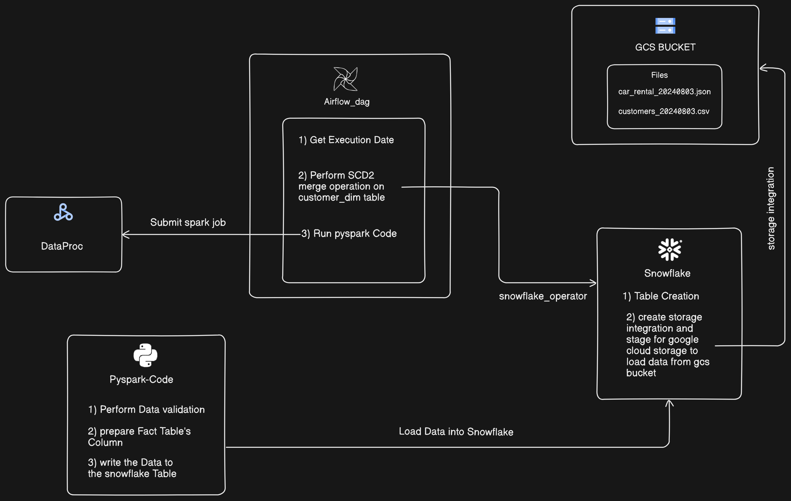

# Car-Rental-Batch-Ingestion-ETL

## Table of Contents
- [Project Overview](#project-overview)
- [Features](#features)
- [Architecture](#architecture)
- [Tech Stack](#tech-stack)
- [Usage](#usage)
- [Data Flow](#data-flow)
- [Data Validation](#data-validation)
- [SCD2 Implementation](#scd2-implementation)
- [Challenges and Solutions](#challenges-and-solutions)
- [Contact](#contact)
## Project Overview
This project demonstrates an ETL pipeline built using Snowflake, PySpark, and Airflow. The pipeline processes two daily files stored in a Google Cloud Storage (GCS) bucket: one containing transaction data and another with customer-related data. The transaction data is validated and transformed before being loaded into a Snowflake table. Additionally, a Slowly Changing Dimension Type 2 (SCD2) merge operation is performed on the customer data to maintain historical accuracy.

## Features
- Automated ETL pipeline orchestrated with Airflow
- Data validation and transformation using PySpark
- SCD2 implementation for customer dimension table in Snowflake
- Integration with Google Cloud Storage for daily data ingestion

## Architecture

The architecture consists of:
- **GCS Bucket**: Stores daily transaction and customer data files.
- **Airflow**: Orchestrates the ETL process, triggering the pipeline daily.
- **PySpark**: Handles data transformation, validation, and load.
- **Snowflake**: Data warehouse where transformed data is stored and perform SCD2 Merge.

## Tech Stack
- **Languages**: Python, SQL
- **Data Processing**: PySpark
- **Orchestration**: Apache Airflow
- **Cloud Storage**: Google Cloud Storage
- **Data Warehouse**: Snowflake
- **Version Control**: Git

## Usage
In this project, we automate the processing of two daily files: one JSON file containing transaction data and another CSV file with customer data changes. The process begins by creating all necessary dimension tables in Snowflake, except for the customer dimension and fact tables. Data is then loaded into these dimension tables.

Next, we establish a storage integration in Snowflake to directly load data from the Google Cloud Storage (GCS) bucket into Snowflake tables. A PySpark job is then executed to validate and transform the incoming transaction data from the JSON file in GCS. This job also prepares the fact table with the required columns by leveraging the Snowflake dimension tables.

To orchestrate the workflow and manage dependencies, an Airflow DAG is used. The DAG is designed to support both daily processing and backfilling of data. It accepts an execution date parameter, allowing users to specify the date for which the files should be processed. If no date is provided, the DAG processes the current day's files. The workflow is structured to first update the customer data, followed by inserting the transformed transaction data into the Snowflake table. This is achieved using the SnowflakeOperator in Airflow, ensuring smooth interaction with Snowflake and maintaining the correct order of operations.

## Data Flow
1. The Airflow DAG is triggered by the user for a specified date.
2. It first updates the customer dimension table in Snowflake if it already exists.
3. New customer data from the GCS bucket is then loaded and inserted into the customer dimension table using Snowflake.
4. The DAG proceeds to load the new transaction data by utilizing PySpark, which reads the data from the Google Cloud Storage bucket and processes it accordingly into the Snowflake.

## Data Validation

1. **Data Ingestion**: The process begins by reading the JSON file containing transaction data into PySpark from gcs bucket.
2. **Data Transformation**: We validate the data, removing any null values to ensure data integrity.
3. **Key Column Integration**: To establish relationships with the dimension tables in Snowflake, we join the fact table with all relevant dimension tables, adding the necessary key columns.
4. **Customer Dimension Filter**: When joining with the customer dimension table, we filter to include only those customer keys where the is_current status is True.
5. **Data Loading**: After selecting the required columns, the processed data is written to the Snowflake transaction table.

## SCD2 Implementation
To connect Airflow with Snowflake, I utilized the SnowflakeOperator, ensuring that the necessary connection is configured in Airflow. The process involves two key steps:

Update Operation: The first SnowflakeOperator updates the status of existing customer records in the dimension table by setting is_active to False whenever updated data is detected in the daily customer_data.csv file.

Insert Operation: The second SnowflakeOperator inserts the new customer data from the customer_data.csv into the customer dimension table.

This approach effectively tracks and manages changes in customer data, ensuring that the latest updates are accurately reflected while maintaining historical records.

## Challenges and Solutions
**Challenge 1**: Finding Compatible JAR Files for Snowflake
Solution: To resolve this, identify the correct version of Spark you are using and download the compatible Snowflake JAR files from the Maven repository. Ensuring compatibility between Spark and the JAR files is crucial for the smooth integration of Snowflake within your pipeline.

**Challenge 2**: Connecting Google Cloud Storage with Snowflake
Solution: Ensure that the Google Cloud service account used for the Snowflake storage integration has the necessary permissions. This includes granting appropriate access to the GCS bucket and allowing Snowflake to interact with your cloud storage resources seamlessly.

## Contact
<a href="https://www.linkedin.com/in/omkar-desai-0075a7192/">LINKEDIN</a>
